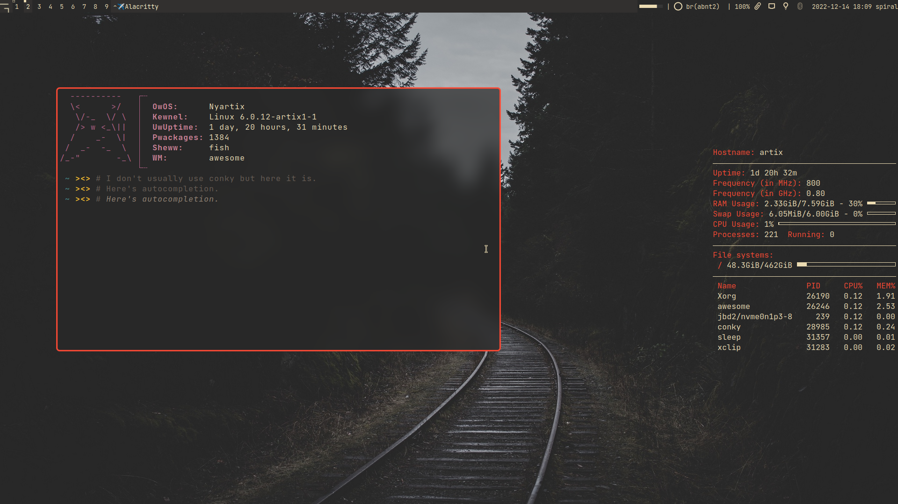

= MAD

*MaybeAnonymous' Dotfiles*

== Before installing

This repository's focus is to backup my dotfiles, if you're not me or an experienced user, I wouldn't recommend installing these.

== My setup

* *Device:* Acer Aspire Laptop

* *OS:* https://artixlinux.org[Artix Linux]

* *Init:* https://github.com/OpenRC/openrc[OpenRC]

* *Shell:* https://fishshell.com[Fish]

* *Display manager:* https://github.com/canonical/lightdm[LightDM]

** LightDM doesn't seem to be able to start Wayland, so run Hyprland from TTY to use it.

* *X window managers:*

** https://i3wm.org[i3]

** https://github.com/baskerville/bspwm[bspwm]

** https://dwm.suckless.org[dwm]

** https://awesomewm.org[awesomewm]

* *Wayland window managers:*

** https://hyprland.org[Hyprland]

* *Screen temperature:*

** Redshift for Xorg (gammastep might work but I haven't tested it)

** https://gitlab.com/chinstrap/gammastep[gammastep] for Wayland

* *Terminal:* https://sw.kovidgoyal.net/kitty/[Kitty]

** https://alacritty.org[Alacritty] config also available!

* *File Manager:* https://github.com/gokcehan/lf[lf]

* *Browser:* https://librewolf.net[Librewolf]

* *Color scheme:* https://github.com/sainnhe/everforest[Everforest]

* *GTK and other theming:*

** *Theme:* https://github.com/Fausto-Korpsvart/Everforest-GTK-Theme[Everforest GTK Theme] BL

** *Icons:* https://github.com/vinceliuice/Tela-circle-icon-theme[Tela Circle Icon Theme] green

** *Cursor:* https://github.com/phisch/phinger-cursors[Phinger Cursors] light

* *Screenshots:*

** https://github.com/naelstrof/maim[maim] (Xorg)

** https://sr.ht/~emersion/grim/[grim] and https://github.com/emersion/slurp[slurp] (Wayland)

== Requirements

=== Applets (Xorg)

* nm-applet

* blueman-applet

* xfce4-clipman

* redshift-gtk

=== General

* https://github.com/Hummer12007/brightnessctl[brightnessctl-git]

* https://github.com/brndnmtthws/conky[Conky]

* https://github.com/derf/feh[feh]

* https://github.com/cdemoulins/pamixer[pamixer]

* https://github.com/davatorium/rofi[Rofi]

** https://github.com/Mange/rofi-emoji[Rofi Emoji]

* https://github.com/naelstrof/maim[maim]

* https://neovim.io/[Neovim]

** https://github.com/wbthomason/packer.nvim[Packer]

* https://github.com/jonaburg/picom[Picom]

* https://github.com/google/xsecurelock[xsecurelock]

=== awesomewm

* Extra widgets from https://github.com/streetturtle/awesome-wm-widgets[here].

** https://sourceforge.net/projects/acpiclient/files/acpiclient/[acpi]

=== bspwm

* https://github.com/MaybeAnonymous/bspswallow[bspswallow]

* https://polybar.github.io/[Polybar]

=== dwm

* Xlib header files

=== Hyprland

* `waybar-hyprland-no-systemd` by me, it's in this repo.

** This is a PKGBUILD which means your distro has to be Arch-based.

=== i3

* Polybar

=== Fonts

* https://www.jetbrains.com/lp/mono/[Jetbrains Mono]

* Siji

* Powerline fonts

* https://www.nerdfonts.com/[Symbols Nerd Fonts]

* `otf-font-awesome`

* Ubuntu Font

== Finalizing

=== Neovim

* Run `:PackerInstall` in Neovim to install the plugins.

=== dwm

* Building:

[,sh]
----
cd ~/.config/dwm && sudo make install && make clean
cd ~/.config/dwmblocks && sudo make install && make clean
# Optional
# cd ~/.config/dmenu && sudo make install && make clean
----

== Pictures

* These are still in the Gruvbox colorscheme and I will update them eventually.

** The ones shown here are up-to-date.

=== awesomewm

=== Hyprland

image::screenshots/Hyprland.png[Screenshot of Hyprland]

