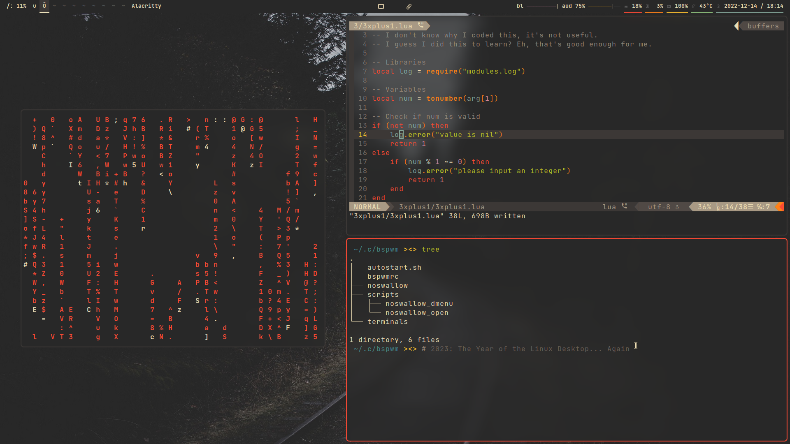

= MAD

*MaybeAnonymous' Dotfiles*

== Before installing

This repository's focus is to backup my dotfiles, if you're not me or an experienced user, I wouldn't recommend installing these.

== My setup

* *Device:* Acer Aspire Laptop

* *OS:* https://artixlinux.org[Artix Linux]

* *Init:* https://github.com/OpenRC/openrc[OpenRC]

* *Shell:* https://fishshell.com[Fish]

* *Display manager:* https://github.com/canonical/lightdm[LightDM]

* *Server:* https://www.x.org[Xorg]

* *Window managers:*

** https://i3wm.org[i3]

** https://github.com/baskerville/bspwm[bspwm]

** https://dwm.suckless.org[dwm]

** https://www.qtile.org[qtile]

** https://awesomewm.org[awesomewm]

* *Terminal:* https://alacritty.org[Alacritty]

* *Browser:* https://librewolf.net[Librewolf]

* *Color scheme:* https://github.com/morhetz/gruvbox[Gruvbox]

== Requirements

=== Applets

* nm-applet

* blueman-applet

* xfce4-clipman

* redshift-gtk

=== General

* https://github.com/Hummer12007/brightnessctl[brightnessctl-git]

* https://github.com/brndnmtthws/conky[Conky]

* https://github.com/derf/feh[feh]

* https://github.com/cdemoulins/pamixer[pamixer]

* https://github.com/davatorium/rofi[Rofi]

** https://github.com/Mange/rofi-emoji[Emoji plugin]

* https://github.com/naelstrof/maim[maim]

* https://neovim.io/[Neovim]

* https://github.com/jonaburg/picom[Picom]

* https://github.com/google/xsecurelock[xsecurelock]

=== awesomewm

* Extra widgets from https://github.com/streetturtle/awesome-wm-widgets[here].

=== bspwm

* https://github.com/MaybeAnonymous/bspswallow[bspswallow]

=== dwm

* Read the https://github.com/bakkeby/dwm-flexipatch[Flexipatch] documentation.

=== Fonts

* https://www.jetbrains.com/lp/mono/[Jetbrains Mono]

* Siji

* Powerline fonts

* https://www.nerdfonts.com/[Symbols Nerd Fonts]

* Ubuntu Font

== Notes

* Run `:PlugInstall` in Neovim to install the plugins.

* Build dwm with `cd ~/.config/dwm && sudo make install; cd ~/.config/dmenu && sudo make install; cd ~/.config/dwmblocks && sudo make install`

== Pictures

image::screenshots/awesome.png[Screenshot of awesomewm]

image::screenshots/dwm.png[Screenshot of dwm]

