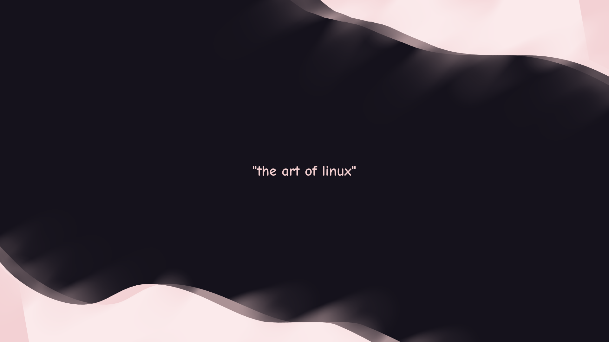

# maybeanonymous' dotfiles

my dotfiles, work in progress

---
**Hello! Backup your dotfiles, and make sure you know what you're doing!**


---

i am not responsible for problems you may get while installing this && know that this isn't complete

**bspwm:** use [this](https://github.com/MaybeAnonymous/bspswallow) for bspwm window swallowing, it's a fork i made of another project

**ufetch:** default is artix, get your own [here](https://gitlab.com/jschx/ufetch) 

**zsh:** it may give you error message, install the plugins [here](https://github.com/zsh-users/zsh-autosuggestions/blob/master/INSTALL.md#oh-my-zsh) and [here](https://github.com/zsh-users/zsh-syntax-highlighting/blob/master/INSTALL.md)

**fish:** my config file is quite simple as i just switched to it, zsh will still be here though.

---
```
!C means closed source/proprietary!!

;; means it is pre-installed and you should not worry

|| means or

+ means and
```

also remember that this is a work in progress, if anything important is missing, tell me

these dotfiles contain two shells and two window managers \( [zsh](https://www.zsh.org/) && [fish](https://fishshell.com), [dwm](https://dwm.suckless.org) && [bspwm](https://github.com/baskerville/bspwm) \) 

i do not plan on making an installation script, and i expect you to know what you're doing

---

# requirements

**YOU MUST HAVE [THIS](https://github.com/uditkarode/libxft-bgra) IF YOU'RE USING DWM**

**shell:**

   >**zsh** + [oh-my-zsh](https://ohmyz.sh) || [fish](https://fishshell.com) + [bass;;](https://github.com/edc/bass)

**either wm:**

   >**fonts>** [JetBrains Mono](https://www.jetbrains.com/lp/mono/), Siji, Powerline Fonts, Symbols Nerd Fonts, [Comic Mono](https://github.com/dtinth/comic-mono-font)
   >
   >**neovim>** [vim-plug;;](https://github.com/junegunn/vim-plug)
   >
   >**applets>** nm-applet, blueman-applet, xfce4-clipman
   >
   >[alacritty](https://alacritty.org)
   >
   >[picom-jonaburg-fix](https://github.com/Arian8j2/picom-jonaburg-fix)
   >
   >[conky](https://github.com/brndnmtthws/conky)
   >
   >[maim](https://github.com/naelstrof/maim)
   >
   >[dmenu](https://tools.suckless.org/dmenu/) || \( [rofi](https://github.com/davatorium/rofi) + [emoji rofi](https://github.com/Mange/rofi-emoji) \)

**[dwm:](https://dwm.suckless.org)**

   > [flexipatch;;](https://github.com/bakkeby/dwm-flexipatch) + [finalizer;;](https://github.com/bakkeby/flexipatch-finalizer)

**[bspwm](https://github.com/baskerville/bspwm)**

**optional:**
   > glava, [neovide](https://github.com/neovide/neovide), [vivaldi!C](https://vivaldi.com) || [ungoogled-chromium](https://github.com/Eloston/ungoogled-chromium), [ufetch](https://gitlab.com/jschx/ufetch)

**more && after installation:**

>to configure neovim you must open it and run `:PlugInstall`
>
>to configure dwm you must `cd ~/.dwm && sudo make install`
>
>to configure dmenu you must `cd ~/.dmenu && sudo make install`
>
> colourscheme: [catppuccin](https://github.com/catppuccin/catppuccin)

---

# bspwm:


# dwm:

i have not taken a picture yet as i am procastinating

---

# wallpaper




Text is in [Comic Neue](http://www.comicneue.com/)


