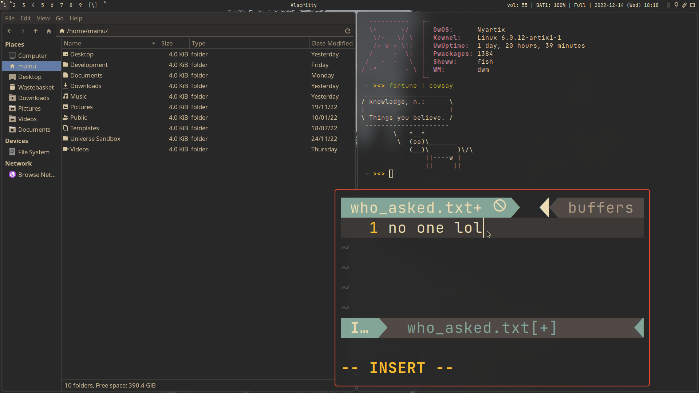

New, work in progress README file.

# MAD

**MaybeAnonymous' Dotfiles**

### Information

**Before installing**

I must warn you that the main focus of this repository is to keep my dotfiles somewhere, if you're not me or an experienced user, installing these may be hard.

**My setup**

* Acer Aspire laptop

* [Artix Linux](https://artixlinux.org) x86\_64

* [OpenRC](https://github.com/OpenRC/openrc)

* [Fish shell](https://fishshell.com)

* [LightDM](https://github.com/canonical/lightdm)

* Configured for [Xorg](https://www.x.org)

* Tiling window managers ( [bspwm](https://github.com/baskerville/bspwm), [dwm](https://dwm.suckless.org), [i3](https://i3wm.org) and [qtile](https://www.qtile.org) )

* [Alacritty](https://alacritty.org) terminal

* [Gruvbox](https://github.com/morhetz/gruvbox) colorscheme

### Requirements

**Applets**

* nm-applet

* blueman-applet

* xfce4-clipman

**General**

* [Alacritty](https://alacritty.org)

* [BrightnessCTL](https://github.com/Hummer12007/brightnessctl)

* [Conky](https://github.com/brndnmtthws/conky) ( I no longer use it but the config's there )

* [Librewolf](https://librewolf.net)

* [pamixer](https://github.com/cdemoulins/pamixer)

* [Rofi](https://github.com/davatorium/rofi)

* [Rofi emoji plugin](https://github.com/Mange/rofi-emoji)

* [maim](https://github.com/naelstrof/maim)

* [Neovim](https://neovim.io/)

* [Nitrogen](https://github.com/l3ib/nitrogen)

* [picom-jonaburg-fix](https://github.com/Arian8j2/picom-jonaburg-fix)

* [Xsecurelock](https://github.com/google/xsecurelock)

**Bspwm**

* My fork of [bspswallow](https://github.com/MaybeAnonymous/bspswallow).

**Dwm**

* Read the [Flexipatch](https://github.com/bakkeby/dwm-flexipatch) documentation.

* Optionally, [dmenu](https://tools.suckless.org/dmenu/).

**Fonts**

* [JetBrains Mono](https://www.jetbrains.com/lp/mono/)

* Siji

* Powerline Fonts

* [Symbols Nerd Fonts](https://www.nerdfonts.com/)

* Ubuntu Font

### Notes

* Run `:PlugInstall` in Neovim when you first install it.

* To build dwm, run `cd ~/.config/dwm && sudo make install; cd ~/.config/dmenu && sudo make install; cd ~/.config/dwmblocks && sudo make install`

### Pictures

**dwm**

